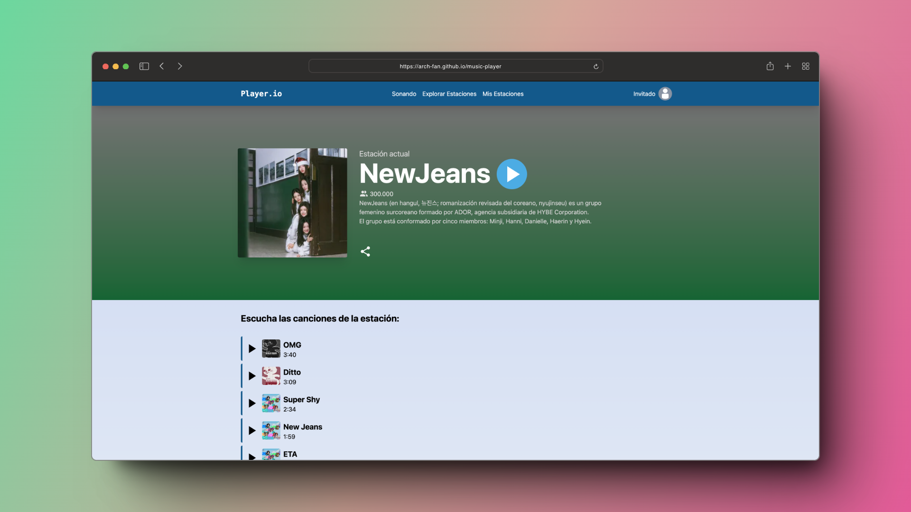

# Jango Clon (Documentación)



<div align="center">
    📎 <a href="https://arch-fan.github.io/music-player">URL</a>
    |
    🗃️ <a href="https://github.com/arch-fan/music-player">Repositorio</a>
</div>

## Vision general

El lenguaje de programacion usado es [TypeScript](https://github.com/microsoft/TypeScript) hecho por Microsoft. Es un superset de JavaScript que compila a una salida limpia de JavaScript. Resumiendo, JavaScript con tipado. Utiliza los ficheros con extension `.ts`

Para poder realizar esta web se hace uso del runtime de JavaScript [Node.JS](https://github.com/nodejs/node).

Se ha usado el framework [Astro](https://astro.build/) como base para realizar la web. He elegido Astro porque permite compilar tu web en HTML y CSS con el JavaScript optimizado y enpaquetado. Utiliza los ficheros `ts`.

Para el estilado se ha usado la libreria [TailwindCSS](https://tailwindcss.com/) que permite aplicar estilos CSS mediante clases.

Finalmente, se ha usado una libreria reactiva llamada [React](https://react.dev/) para manejar la logica del reproductor, permitiendonos tener estados que actualizan nuestros componentes automaticamente. Esta libreria utiliza los ficheros con extension `.tsx`.

Para ver todas las dependencias, mirar el fichero [package.json](./package.json)

## Organizacion del proyecto

Dentro de la carpeta `src` se encuentra toda la web. Dentro de esta carpeta podemos encontrar las siguientes carpetas:

```bash
󱧼 src
├──  assets
├──  components
├──  data
├──  layouts
├──  pages
└──  utils
```

- **assets**: Guarda algunas imagenes usadas en la web
- **components**: Guarda todos los componentes. Dentro incluye una carpeta player que mas adelante veremos
- **data**: Incluye algunos datos de la web guardados en ficheros de TypeScript como los datos de la playlist o los posibles usuarios
- **layouts**: Guarda los componentes layout de astro, que envuelven cada web.
- **pages**: Define todas las paginas existentes en la web. Esta incluye el login, el reproductor y el 404.
- **utils**: Incluye funciones utiles para usar en cualquier lado.

## Componentes

Dentro de la carpeta componentes podemos ver todos los componentes que se usan en la web.

```bash
 components
├──  Commands.astro
├──  Followers.astro
├──  Hero.astro
├──  Icons.tsx
├──  Modal.tsx
├──  Navbar.astro
├──  player
├──  Profile.tsx
└──  Share.tsx
```

Cada uno encapsula una parte del codigo. El componente profile tiene el codigo encargado de cargar el usuario desde el query param junto a su imagen de perfil.

El nucleo del proyecto esta en la carpeta `player` que es la que encapsula toda la lógica del reproductor.

## Player

Dentro de la carpeta player vemos los componentes que manejan el reproductor.

```bash
 player
├──  AudioBar.tsx
├──  Controls.tsx
├──  Lyrics.tsx
├──  Play.tsx
├──  Player.module.css
├──  Player.tsx
├──  Playlist.tsx
├──  ProgressBar.tsx
├──  Speed.tsx
└──  track.store.ts
```

En `track.store.ts` tenemos todos los estados del reproductor junto a sus setters:

```ts
interface TrackState {
  currentTrack: Track | null;
  playlist: Track[];
  isPlaying: boolean;
  audioElement: React.RefObject<HTMLAudioElement>;
  volume: number;
  isLoop: boolean;
  isRandom: boolean;
  setIsLoop: (isLoop: boolean) => void;
  setIsRandom: (isRandom: boolean) => void;
  setTrack: (track: Track) => void;
  setVolume: (volume: number) => void;
  setIsPlaying: (isPlaying: boolean) => void;
  setPreviousSong: () => void;
  setFirstTrack: () => void;
  setNextSong: () => void;
}
```

Este interfaz define la funcionalidad de cada estado, por lo que si se quiere ver el estado inicial mejor ver [el fichero](./src/components/player/track.store.ts).

Todos los ficheros dentro de `player` estan comentados explicando la funcionalidad interna, recomiendo leerlos ya que te explican como funcionan por dentro.

## Funcionalidades

Se describen en la siguiente lista. Si vas dando click, puedes ir al codigo

- [Selector de perfil con confeti cuando entras al perfil de Vicente](./src/components/Profile.tsx)
- [Responsive (CSS)](./src/pages/index.astro)
- [Barra de reproductor](./src/components/player/Player.tsx)
- [Controles (anterior, siguiente, shuffle, loop y pausa)](./src/components/player/Controls.tsx)
- [Barra de progreso](./src/components/player/ProgressBar.tsx)
- [Barra de volumen](./src/components/player/AudioBar.tsx)
- [Boton de lyrics + parte visual](./src/components/player/Lyrics.tsx)
- [Velocidad de reproduccion](./src/components/player/Speed.tsx)
- [Lista de canciones que se reproduce al hacer click + Boton de youtube](./src/components/player/Playlist.tsx)
- [Comandos para teclado (Visibles en la web y en el js)](./src/components/player/Player.tsx)

## Canciones

Las canciones se encuentran dentro de [public/music](./public/music/)

## Despliegue del proyecto

Para desplegar el proyecto, lo primero necesitas tener [Node.JS](https://nodejs.org/en/download) instalado

Una vez instalado, entras con el terminal a la carpeta del proyecto y ejecutas el siguiente comando para instalar las dependencias

```bash
npm install
```

Una vez instaladas las dependencias, ejecuta el siguiente comando para levantar el servidor de desarrollo:

```bash
npm run dev
```

Si se quiere hacer una build de la web ejecutar

```bash
npm run build
```
